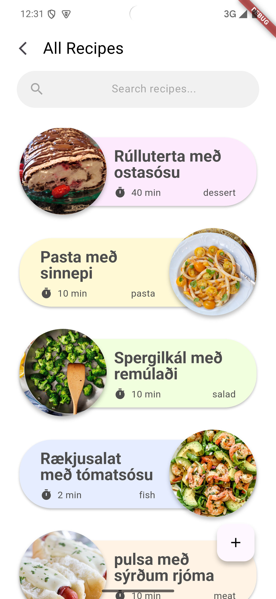
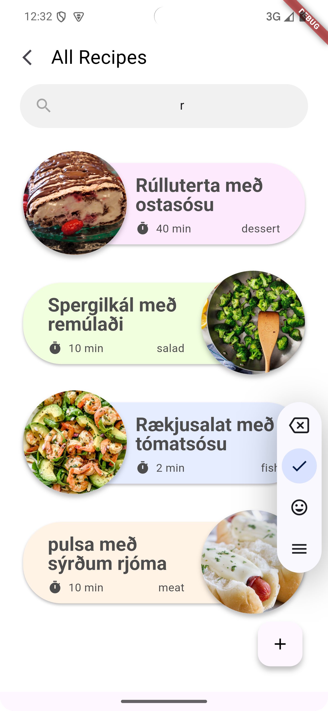
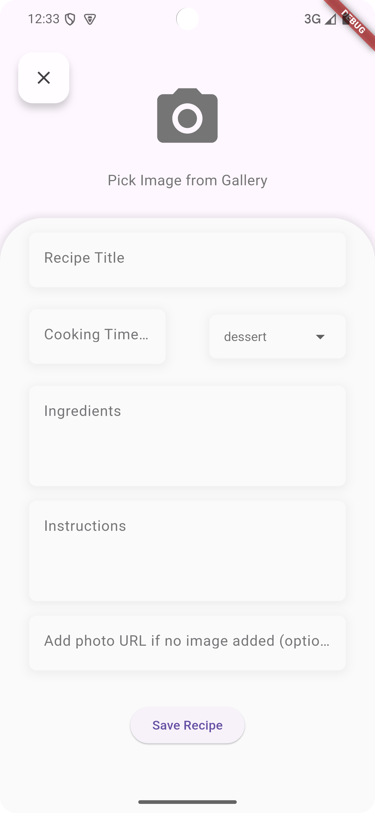
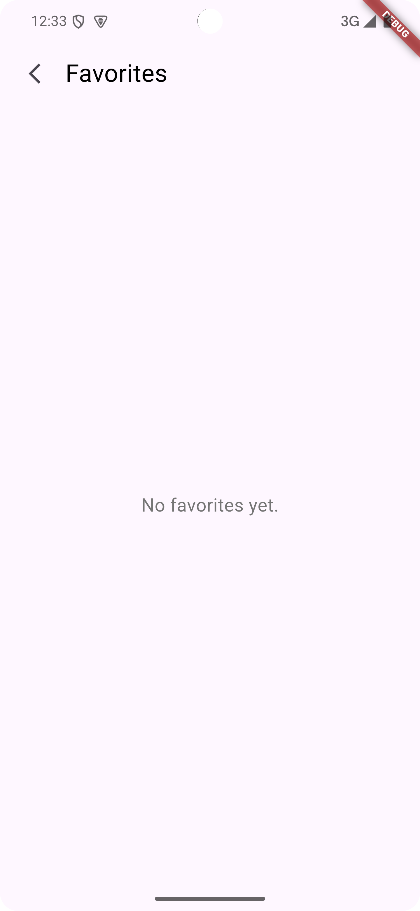

# RecipeApp

**RecipeApp** is a Flutter-based mobile application that allows users to explore, search, and manage their favorite recipes. The app provides a clean and intuitive UI to add new recipes, mark them as favorites, and view detailed recipe instructions.

## Features

- **Recipe List**: Displays a list of recipes with categories and cooking times.
- **Search Bar**: Allows users to filter recipes based on their title.
- **Recipe Cards**: Displays recipe details such as ingredients, cooking instructions, and an image.
- **Image Upload**: Users can upload an image of the recipe (either from the camera or gallery).
- **Favorites**: Users can mark recipes as favorites.
- **Recipe Details**: View a detailed view of a selected recipe with more information and steps.

## Screenshots

!

## Technologies Used

- **Flutter**: The framework used to build this mobile app.
- **Dart**: Programming language for Flutter.
- **Image Picker**: Allows the app to pick images from the gallery or camera.
- **Permission Handler**: Manages permissions to access the camera and gallery.
- **Provider/State Management**: Ensures the app's state is managed cleanly when recipes are added, deleted, or modified.

## Usage

- **Add a Recipe**: To add a recipe, tap on the 'Add Recipe' button, fill in the title, ingredients, cooking time, and upload an image from your camera or gallery.
- **View Recipe**: Tap on any recipe card to view detailed instructions, ingredients, and cooking steps.
- **Favorite Recipes**: Mark a recipe as a favorite by tapping on the heart icon.
- **Search Recipes**: Use the search bar to quickly filter and find recipes by their title.

## License

This project is open-source and available under the MIT License. Please refer to the LICENSE file for more details.
